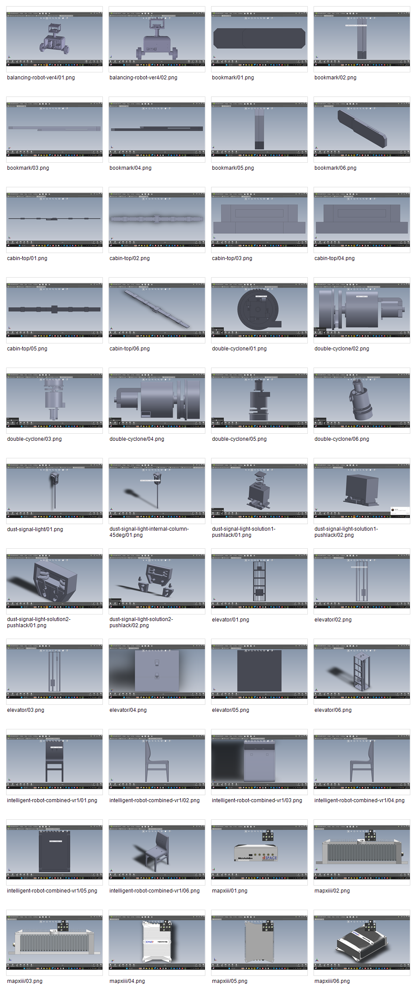

# Assembly Previews

`.SLDASM` 파일은 GitHub에서 바로 렌더링되지 않습니다. 이 폴더는 조립 파일을 그냥 보관하는 데서 끝내지 않고, eDrawings에서 직접 확인한 화면을 함께 남겨서 조립 상태를 읽을 수 있게 만든 미리보기 아카이브입니다.

처음에는 STL export로 간단한 대체 이미지를 만들었지만, 조립체의 방향, 부품 관계, 내부 구조를 보여주기에는 부족했습니다. 그래서 대표 preview와 contact sheet를 eDrawings 캡처 기반으로 교체했습니다.

## eDrawings Captures

`edrawings-captures/`에는 eDrawings에서 직접 열어 캡처한 assembly 화면을 조립체별로 정리했습니다.

| Capture folder | Related assembly |
| --- | --- |
| `edrawings-captures/balancing-robot-ver4/` | `models/assemblies/assemble/balancing-robot/balancing robot_ver4.SLDASM` |
| `edrawings-captures/mapxiii/` | `models/assemblies/assemble/MAPXIII/MAPXIII.SLDASM` |
| `edrawings-captures/dust-signal-light/` | `models/assemblies/assemble/미세먼지신호등/미세먼지신호등.SLDASM` |
| `edrawings-captures/dust-signal-light-internal-column-45deg/` | `models/assemblies/assemble/미세먼지신호등/미세먼지신호등_내부기둥45도버전.SLDASM` |
| `edrawings-captures/dust-signal-light-solution1-pushlack/` | `models/assemblies/assemble/미세먼지신호등 솔루션1/*.SLDASM` |
| `edrawings-captures/dust-signal-light-solution2-pushlack/` | `models/assemblies/assemble/미세먼지신호등 솔루션2/*.SLDASM` |
| `edrawings-captures/elevator/` | `models/assemblies/assemble/엘레베이터/엘레베이터.SLDASM` |
| `edrawings-captures/cabin-top/` | `models/assemblies/assemble/엘레베이터/캐빈위.SLDASM` |
| `edrawings-captures/double-cyclone/` | `models/assemblies/assemble/신형사이쿨론/이중 사이클론.SLDASM` |
| `edrawings-captures/intelligent-robot-combined-vr1/` | `models/assemblies/assemble/지능형로봇공모전/지능형로봇합체본_vr1.SLDASM` |
| `edrawings-captures/bookmark/` | `models/assemblies/assemble/책깔피/책깔피.SLDASM` |

## Representative Views

These top-level images are selected from the eDrawings capture set so the repository can show useful assembly views without opening CAD software.

| Preview | Related assembly / project | Source capture |
| --- | --- | --- |
| `double-cyclone.png` | `assemblies/assemble/신형사이쿨론/이중 사이클론.SLDASM` | `edrawings-captures/double-cyclone/06.png` |
| `elevator-assembly-related.png` | `assemblies/assemble/엘레베이터/*.SLDASM` | `edrawings-captures/elevator/06.png` |
| `intelligent-robot-assembly-related.png` | `assemblies/assemble/지능형로봇공모전/지능형로봇합체본_vr1.SLDASM` | `edrawings-captures/intelligent-robot-combined-vr1/06.png` |
| `bookmark-assembly-related.png` | `assemblies/assemble/책깔피/책깔피.SLDASM` | `edrawings-captures/bookmark/06.png` |

## Reading The Captures

이 캡처들은 예쁜 렌더링보다 조립 검토 기록에 가깝습니다. 정면, 측면, 상단, 사선 뷰를 남겨 두면 나중에 파일명만 봐서는 알기 어려운 부품 배치와 간섭 가능성을 빠르게 떠올릴 수 있습니다.

특히 미세먼지 신호등 계열은 기본안, 내부기둥 45도안, 솔루션 1/2를 한 흐름으로 비교하기 위해 남겼습니다. 단순히 결과물 하나를 보여주는 것이 아니라, 내부 공간 부족을 해결하려고 어떤 방향들을 시험했는지 보여주는 증거입니다.

## Contact Sheet

