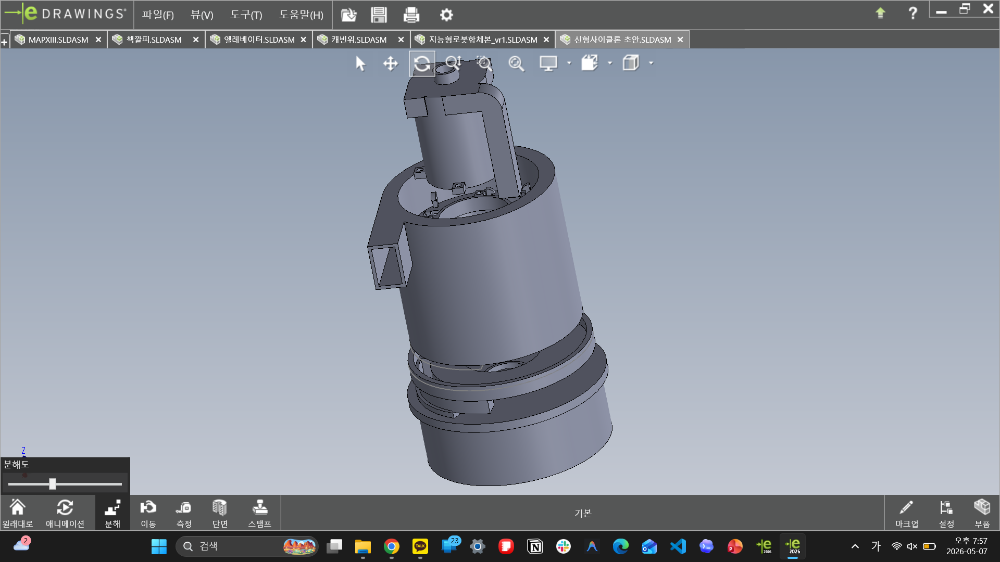

# Cyclone Systems

사이클론 관련 모델은 원통형 구조, 유입부/배출부, 하부 파트, 지지 다리, 이중 흐름 구조를 반복해 본 기록입니다.

## Contents

| Folder | Content |
| --- | --- |
| `assemblies/` | new cyclone and double cyclone assembly files |
| `parts/source-cad/` | classic, new, and double cyclone source CAD |
| `exports/stl/` | STL exports by cyclone family |
| `images/edrawings/` | double cyclone eDrawings capture set |
| `images/previews/` | representative preview images |

## Model Groups

| Group | Local folders |
| --- | --- |
| Classic cyclone | `parts/source-cad/사이클론`, `exports/stl/사이클론` |
| New cyclone | `parts/source-cad/신형 사이클론`, `exports/stl/신형사이클론` |
| Double cyclone | `parts/source-cad/이중사이클론`, `exports/stl/이중사이클론`, `assemblies/` |

## What This Captures

- 원통형 몸통, 뚜껑, 하부 파트, 지지 다리의 분할
- `실험`, `보수`, `차단막`, `윗대가리`처럼 버전이 갈라진 흔적
- 출력 가능한 방향과 분리 가능한 부품 구조에 대한 시행착오
- 이중사이클론은 분리/흐름 과정을 두 단계로 만들려는 확장 실험
