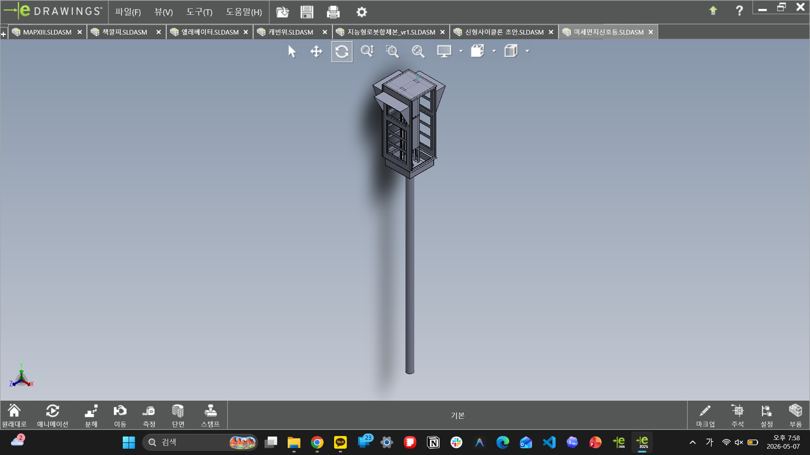

# Dust Signal Light

미세먼지 신호등 모델은 기계설계2 과제 흐름 안에서 진행한 제품형 구조 설계입니다. `미세먼지신호등`, `내부기둥45도버전`, `솔루션1`, `솔루션2`는 서로 독립된 결과물이 아니라, 같은 신호등 구조 안에서 내부 공간과 작업성을 개선해 보려던 연속 실험으로 봅니다.

## Contents

| Folder | Content |
| --- | --- |
| `assemblies/` | base, 45-degree internal column, solution 1/2 assemblies |
| `parts/source-cad/` | signal light source parts and mechanical design variants |
| `images/edrawings/` | eDrawings captures for each assembly version |

## Design Problem

기본 신호등 구조는 실제 모형에 가까웠지만 내부 공간이 부족했습니다. 배선, LED 판, 내부 부품에 접근하는 시간이 길어지는 문제가 있었고, 단순히 선을 정리하는 것보다 작업자가 자주 만지는 판 자체를 빠르게 떼고 붙일 수 있는 구조가 더 중요했습니다.

## Version Reading

| Version | Reading |
| --- | --- |
| `미세먼지신호등` | 실제 모형에 가까운 기준안 |
| `내부기둥45도버전` | 내부 판/기둥을 돌려 접근성을 높이려던 실험, 효율은 낮았던 안 |
| `솔루션1` | push-latch / push-lock 느낌의 첫 후속안, 형태가 다소 약한 느낌 |
| `솔루션2` | 솔루션1의 약한 느낌을 보완하려던 후속안 |

## What This Captures

- 내부 공간 부족을 구조로 해결하려던 흐름
- 문, 기둥, 밑판, 컨트롤판 등 기능별 파트 분리
- assembly에서 내부 공간과 조립 관계를 확인한 흔적
- 단일 결과물보다 여러 대안을 비교한 과정
