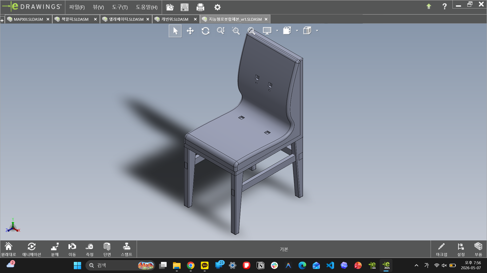

# Intelligent Robot

지능형 로봇 공모전 계열 모델과 의자형/로봇형 구조 실험을 묶은 프로젝트입니다.

## Contents

| Folder | Content |
| --- | --- |
| `assemblies/` | combined intelligent robot assembly |
| `parts/source-cad/` | body, chair, cases, sensor parts |
| `exports/stl/` | printable STL exports |
| `images/edrawings/` | assembly captures |
| `images/previews/` | representative previews |

## What This Captures

- 로봇 몸체와 의자형 구조를 오가며 만든 형태 실험
- Arduino Mega case, sensor case, support pieces 같은 부품 분리
- assembly 캡처를 통해 전체 비례와 방향을 확인한 기록
