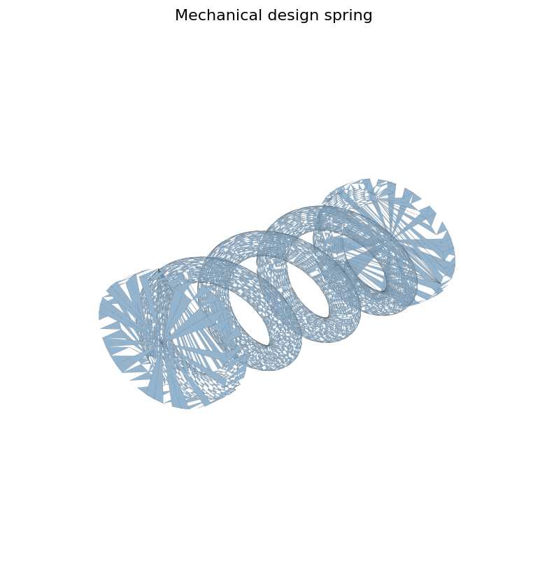

# Mechanical Design Exercises

기계설계2 관련 폴더는 공차, 스프링, 팔, 판 부착장치처럼 기본 기계 요소를 모델링하며 버전을 비교한 연습 기록입니다.

## Contents

| Folder | Content |
| --- | --- |
| `parts/source-cad/` | exercise source CAD and tolerance tests |
| `exports/stl/` | STL exports for exercise variants |
| `images/previews/` | representative spring preview |

## What This Captures

- 공차 테스트와 체결 감각 확인
- 스프링 형태와 단면 조건 비교
- 팔/링크/판 부착장치의 스케일과 형상 반복

미세먼지 신호등 과제와 일부 흐름이 연결되지만, 실제 신호등 구조 개선 자료는 [dust-signal-light](../dust-signal-light/) 쪽에 모았습니다.
