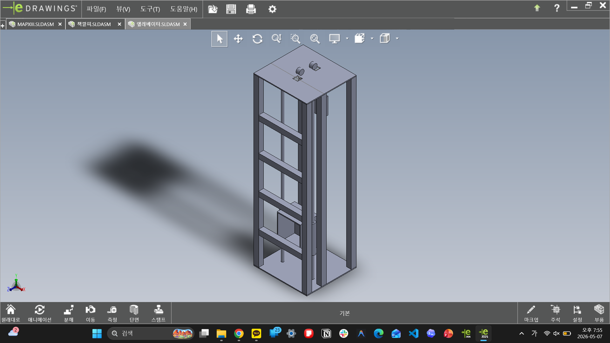

# Passing Elevator

패싱 엘리베이터 모델은 캐빈, 연결 부품, 리니어 이동 구조를 가진 기구 모델입니다.

## Contents

| Folder | Content |
| --- | --- |
| `assemblies/` | elevator, cabin top, and related assembly files |
| `parts/source-cad/` | passing elevator and capstone source CAD |
| `exports/stl/` | STL exports for cabin and connector parts |
| `images/edrawings/` | elevator and cabin-top captures |
| `images/media/` | photos and local motion clips from the physical/visual review |
| `notes/` | printed build notes and media context |
| `images/previews/` | representative preview images |

## What This Captures

- 케빈/바닥/연결부를 나누는 구조
- 위쪽 캐빈과 전체 엘리베이터 assembly를 따로 확인한 흐름
- 리니어 이동 구조와 하우징을 함께 보는 기계 설계 연습
- 사진과 시연 영상을 같이 보면서, 단순 모델 목록이 아니라 동작 맥락까지 남기는 구성

## Printed Build

실제 출력물 사진과 `패싱/논패싱` 동작 확인 영상은 [Printed Passing Elevator Build](notes/printed-build.md)에 정리했습니다. 이 자료는 assembly 파일, STL 출력물, 실제 움직임 확인을 한 흐름으로 이어서 보기 위한 기록입니다.
