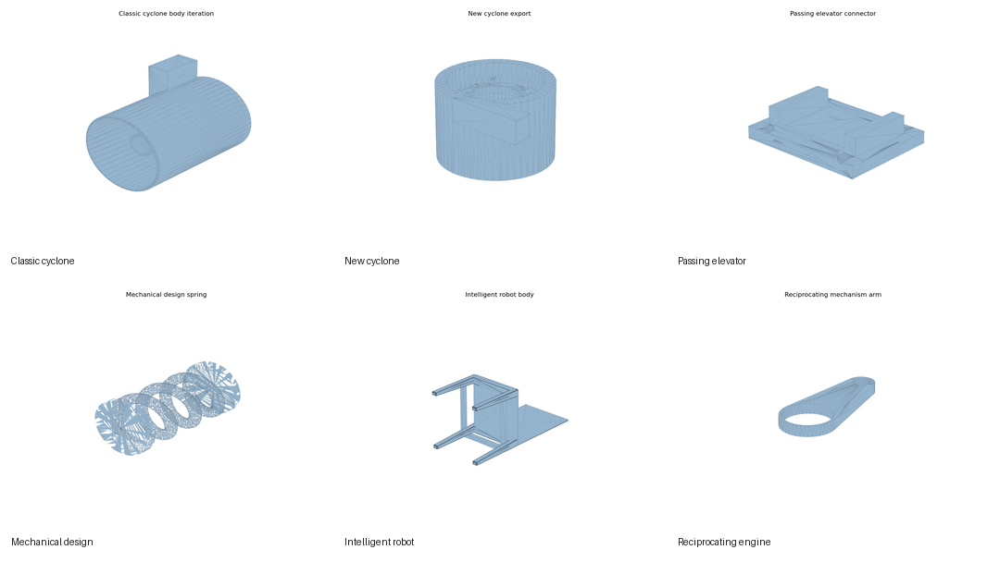

# Modeling Project Index

이 폴더는 모델링 파일을 프로젝트 단위로 다시 읽기 쉽게 묶은 인덱스입니다. `models/`는 실제 파일 아카이브이고, 이 문서는 각 폴더가 어떤 공부와 제작 흐름이었는지 설명합니다.

## Project Map

| Project | Main folders | What I practiced | Notes |
| --- | --- | --- | --- |
| Balancing robot hardware | `balancing robot`, `new_balencerobot`, `ros_balencerobot_descriptoin` | 부품 배치, 센서/보드/배터리 장착, 출력 부품 분할 | [hardware notes](balancing-robot-hardware.md), [cases and mounts](cases-and-mounts.md) |
| Cyclone models | `사이클론`, `신형 사이클론`, `이중사이클론` | 원통형 구조, 유입/배출부, 반복 설계 | [cyclone systems](cyclone-systems.md) |
| Passing elevator | `passing elevator`, `패싱 엘리베이터` | 리니어 이동 구조, 케빈/바닥/연결 부품 | [passing elevator](passing-elevator.md) |
| Mechanical design exercises | `기계설계2`, `기계설계2_solution*`, `기계설계2_1`, `기계설계2_2`, `너트볼트공차Test` | 공차, 스프링/팔/판 부품, 버전 비교 | [mechanical exercises](mechanical-design-exercises.md) |
| Dust signal light | `미세먼지신호등`, `assemble/미세먼지*` | 내부 공간, 열리는 문, 기둥/밑판/컨트롤판 구성 | [dust signal light](dust-signal-light.md) |
| Intelligent robot / structure models | `지능형로봇`, `지능형`, `켑스톤디자인` | 몸체, 지지대, 센서 케이스, 트러스 구조 | [intelligent robot](intelligent-robot.md) |
| Mechanism and utility models | `왕복기관`, `왕복운동기관`, `운동`, `운동기구`, `책갈피`, `책깔피`, `컵받이`, `스마트워치`, `집` | 소형 기구, 생활 출력물, 형태 연습 | [utility and mechanism models](utility-and-mechanism-models.md) |

## Version Notes

버전별로 왜 나뉘었는지는 아직 전부 정리하지 않았습니다. 빈 칸은 [version and iteration notes](../notes/version-iteration-notes.md)에 남겨 두었습니다.

