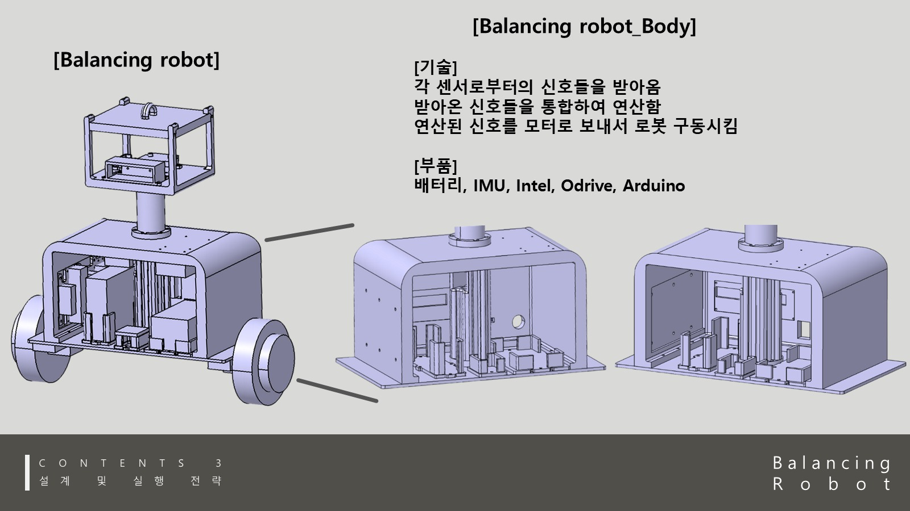
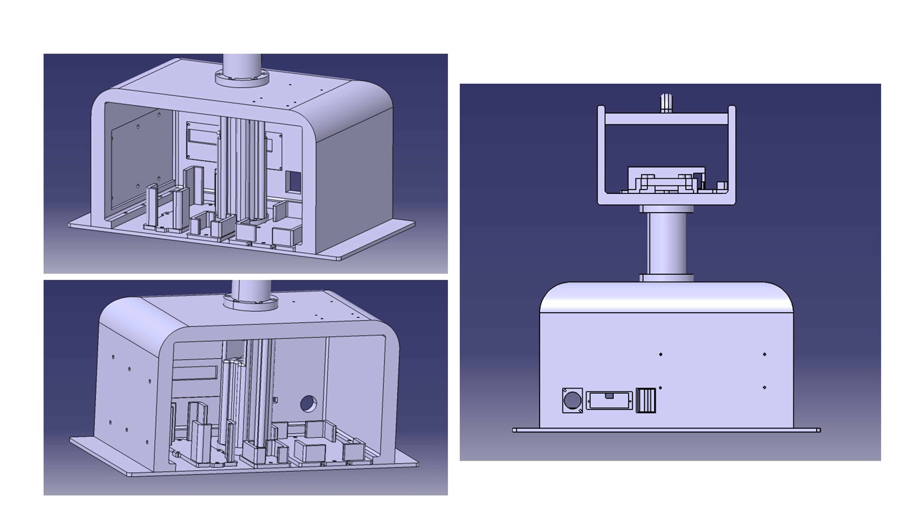

# Balancing Robot Hardware Modeling

밸런싱 로봇 프로젝트에서 3D 모델링은 전자부품을 담는 껍데기를 만드는 수준이 아니라, 실제 제어 실험을 버티는 하드웨어 구조를 만드는 작업이었습니다.

## Design Goal

- Arduino Mega 2560, ODrive, BNO055, Gemini 335, receiver, 배터리, 보조 회로를 한 로봇 안에 배치합니다.
- 출력 가능한 부품으로 나누고, 조립 후에도 센서와 보드에 접근할 수 있게 합니다.
- 밸런싱 로봇 특성상 넘어질 수 있으므로, 충격과 바닥 접촉을 고려한 보호 구조를 둡니다.

## Representative Exports

| File | Role |
| --- | --- |
| `balancing_robot_board_plate.stl` / `.stp` | 기본 보드 장착 플레이트 |
| `balancing_robot_package_ver2.stl` | 내부 전자부품 패키징 실험 |
| `balancing_robot_side_ver2.stl` | 사이드 프레임/보호 구조 |
| `battery_plate.stl` | 배터리 장착 플레이트 |
| `breadboard_plate.stl` | 브레드보드/보조 회로 장착 |
| `intel_plate.stl` | 온보드 PC/보드류 장착 실험 |
| `gemini335_case.stl` | RGB-D 카메라 케이스 |
| `lidar_case_ver2.stl` | LiDAR/센서 장착 케이스 |
| `robot_neck.stl` | 상부 센서 헤드 연결부 |

The curated public exports are in [cad_exports/balancing-robot](../cad_exports/balancing-robot).

## Assembly Thinking

설계하면서 가장 중요했던 것은 부품 하나하나의 형상보다 **실제 조립했을 때 유지보수가 가능한가**였습니다.

- 배터리는 무게중심과 탈착성을 함께 고려해야 했습니다.
- 센서 헤드는 시야 확보와 케이블 라우팅이 같이 맞아야 했습니다.
- 제어 보드는 고정성과 접근성이 모두 필요했습니다.
- 보호 브라켓은 안전장치이면서 동시에 실제 기울기 제한의 기준이 되었습니다.

## Build Takeaway

이 작업은 CAD, 3D printing, 로봇 제어 실험이 분리된 일이 아니라는 점을 보여줍니다. 기구 설계가 잘못되면 센서 배치, 제어 안정성, 실험 안전성이 모두 흔들리기 때문에 하드웨어 모델링을 시스템 설계 일부로 다뤘습니다.
