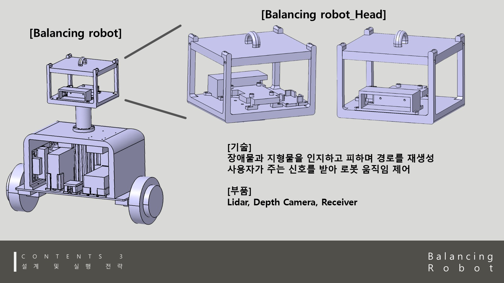

# Cases and Mounts

센서 케이스와 마운트류는 작은 부품처럼 보이지만, 실제 로봇에서는 신호 품질과 유지보수성을 결정합니다.

## Examples

| Part | Design concern |
| --- | --- |
| Gemini 335 case | 카메라 시야, 케이블 출구, 상부 헤드 장착 |
| LiDAR case | 센서 높이, 스캔 평면, 고정성 |
| Receiver / board plates | 신호선 정리, 보드 접근성, 진동 중 고정 |
| Robot neck | 센서 헤드와 본체 연결, 넘어짐 충격에 대한 구조 |

## Notes

- 케이스는 단순히 감싸는 부품이 아니라, 센서의 방향과 기준 좌표계를 고정하는 역할을 했습니다.
- 출력 방향에 따라 체결부 강도가 달라질 수 있어, 장착 방향과 지지대 위치를 함께 생각해야 했습니다.
- 전자부품은 열, 케이블, 탈착성이 있어서 “딱 맞는 케이스”보다 “다시 열 수 있는 케이스”가 더 유용했습니다.

## Evidence

- [gemini335_case.stl](../cad_exports/balancing-robot/gemini335_case.stl)
- [lidar_case_ver2.stl](../cad_exports/balancing-robot/lidar_case_ver2.stl)
- [robot_neck.stl](../cad_exports/balancing-robot/robot_neck.stl)

