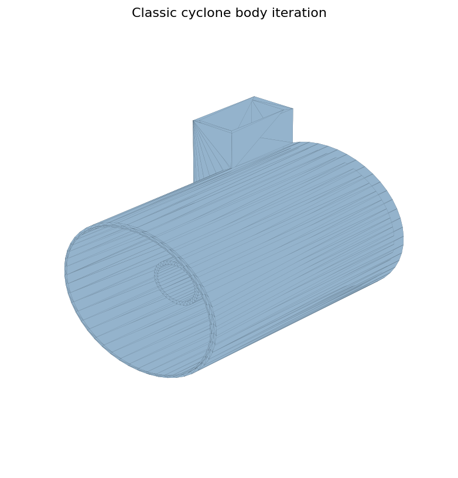
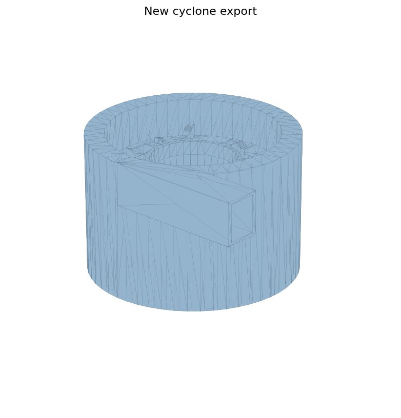

# Cyclone Systems

사이클론 관련 모델은 원통형 구조, 유입부/배출부, 내부 흐름을 고려한 형태를 여러 번 바꿔 본 기록입니다.

## Model Groups

| Group | Where |
| --- | --- |
| Classic cyclone | `models/stl-exports/stl/사이클론`, `models/source-cad/SLDPRT/사이클론` |
| New cyclone | `models/stl-exports/stl/신형사이클론`, `models/source-cad/SLDPRT/신형 사이클론` |
| Double cyclone | `models/stl-exports/stl/이중사이클론`, `models/source-cad/SLDPRT/이중사이클론` |

## What This Captures

- 원통형 몸통, 뚜껑, 하부 파트, 지지 다리의 분할
- `실험`, `보수`, `차단막`, `윗대가리`처럼 버전이 갈라진 흔적
- 출력 가능한 방향과 분리 가능한 부품 구조에 대한 시행착오
- 이중사이클론은 사이클론 과정을 두 번 거치는 구조를 만들기 위한 확장 실험
- `신형사이클론`은 파일 수정 시간이 더 늦은 편이므로, 현재는 후반 버전 계열로 기록

## Version Reading

파일명과 수정 시간을 기준으로 보면 `사이클론_몸통_실험1/2/3`처럼 숫자가 뒤로 갈수록 뒤 버전에 가깝고, `신형사이클론` 계열은 그 이후에 만든 후반 실험으로 봅니다. 다만 `실험1/2/3` 각각의 정확한 설계 의도는 아직 확정하지 않았습니다.

`이중사이클론`은 일반 사이클론 흐름을 한 번 더 거치는 구조, 즉 분리/흐름 과정을 두 단계로 만들려는 의도에서 나온 모델로 정리합니다.

## Open Notes

- `실험1/2/3`의 정확한 차이 확인 필요
- 어떤 버전이 실제 출력에 가까웠는지 확인 필요
