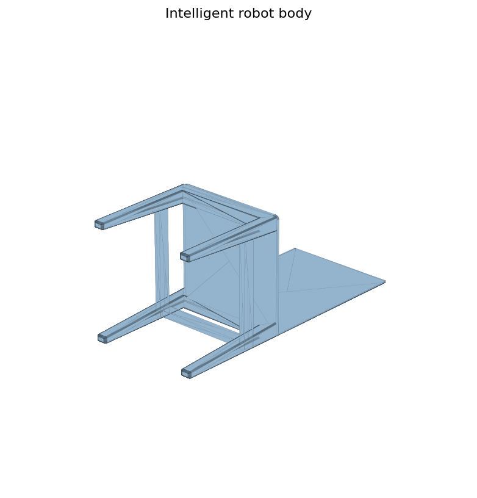

# Intelligent Robot and Structure Models

지능형 로봇 관련 모델은 몸체, 지지대, 센서 케이스, 트러스/프레임류를 여러 버전으로 만든 기록입니다. 의자형처럼 보이는 구조도 이 흐름에서는 지능형 로봇 모델링으로 분류합니다.

## Model Groups

| Group | Where |
| --- | --- |
| Source CAD | `models/source-cad/SLDPRT/지능형로봇` |
| STL exports | `models/stl-exports/stl/지능형` |

## What This Captures

- 몸체/눈/등받이/지지대처럼 여러 부품을 조합한 지능형 로봇 구조
- `vr1`부터 여러 버전으로 나뉜 몸통바디 실험
- 초음파 센서 실험장치, Arduino case, 트러스 부품 같은 확장 모델
- 캡스톤디자인 폴더와는 별도 흐름으로 취급

## Open Notes

- 지능형 로봇 공모전과 각 부품의 관계 설명 필요
- 캡스톤디자인 폴더는 별도 문서로 분리할지 확인 필요
