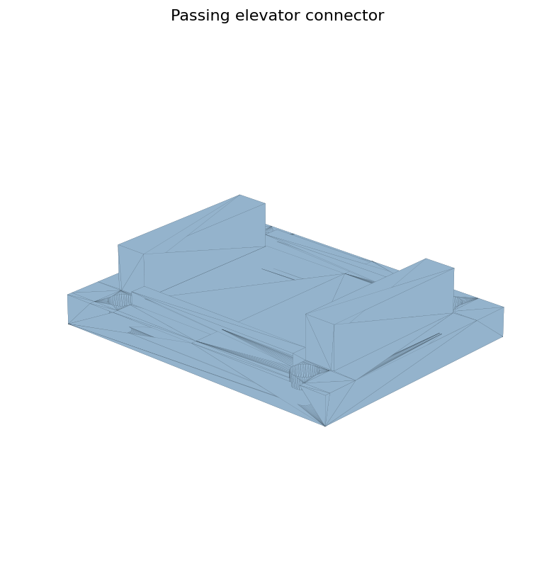

# Passing Elevator

패싱 엘리베이터 모델은 케빈, 바닥, 리니어 연결장치, 선정리 부품처럼 움직이는 구조 주변의 부품을 나눠 설계한 기록입니다.

## Model Groups

| Group | Where |
| --- | --- |
| Source assembly | `models/source-cad/SLDPRT/passing elevator` |
| STL exports | `models/stl-exports/stl/패싱 엘리베이터` |

## What This Captures

- 케빈/바닥/연결부로 나누어 생각한 구조
- `리니어 연결장치`, `선정리`, `bottom connection` 같은 기능성 부품
- 조립 후 움직임과 케이블 정리를 같이 고려한 흔적

## Open Notes

- “패싱 엘리베이터”의 원래 목표와 동작 방식 설명 필요
- 어떤 부품이 최종안이고 어떤 부품이 실험안인지 확인 필요

