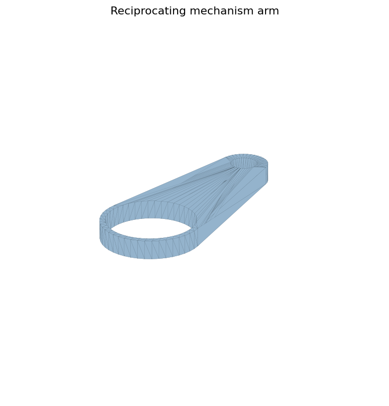
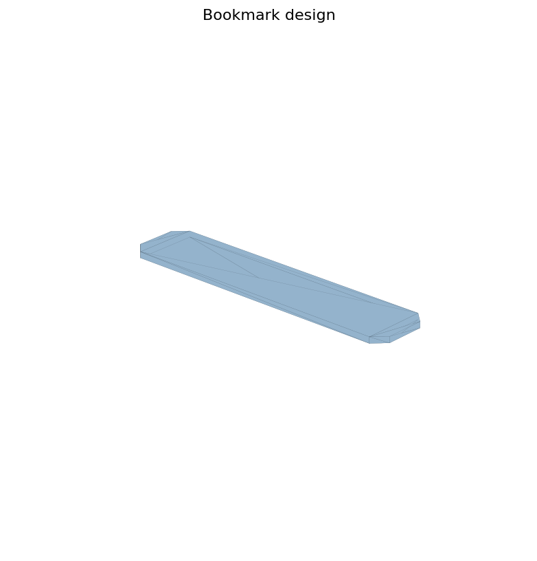

# Utility and Mechanism Models

이 문서는 작은 기능성 모델과 기구 연습 모델을 묶은 기록입니다.

## Model Groups

| Group | Where | Notes |
| --- | --- | --- |
| Reciprocating mechanism | `models/source-cad/SLDPRT/왕복기관`, `models/stl-exports/stl/왕복운동기관` | 회전/왕복 운동 파트 연습 |
| Exercise / desk fixture models | `models/source-cad/SLDPRT/운동`, `models/stl-exports/stl/운동기구` | 책상 결합바, 연결 부품 |
| Small utility prints | `책갈피`, `책깔피`, `컵받이`, `스마트워치`, `집` | 생활 출력물과 형태 연습 |

## Small Preview

## Open Notes

- 각 소형 출력물이 실제 출력되었는지 확인 필요
- 왕복기관 모델의 동작 원리와 조립 의도 설명 필요

